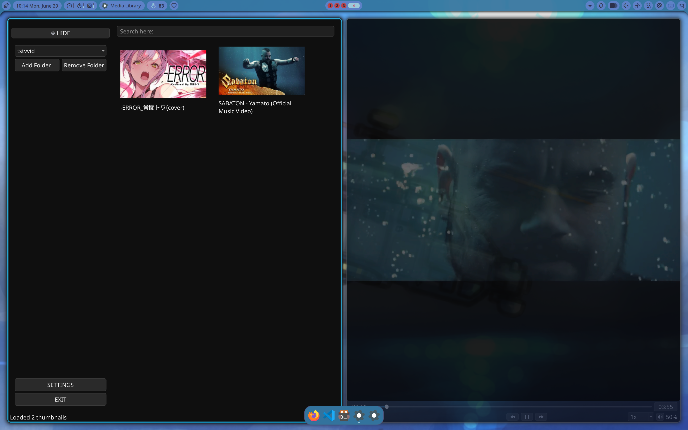

# Offline-YT-Player
[hackatime badge](https://hackatime.hackclub.com/api/v1/badge/U0BBCS6KN00/Furyx407/Offline-YT-Player)

An offline media player that displays thumbnails and title.

# Supported Video types:
 mp4, .mkv, .webm, .mov, .avi
# Supported Image types:
 .png, .jpg, .jpeg, .webp, .heic 

Requirements:
Python & PyQt6

# Installation:
Download Media.py OR Media (for linux)

# How to use:
PYTHON FILE
run `python Media.py` or `python3 Media.py` in terminal (or equivalent for your OS) 
EXECUTABLE
run it as an executable

# Software used:
Visual Studio Code (Coding all features),
Qt Creator (See ui options)

# AI USE:
AI has been used to find errors (generally caused by my own stupidity :D )